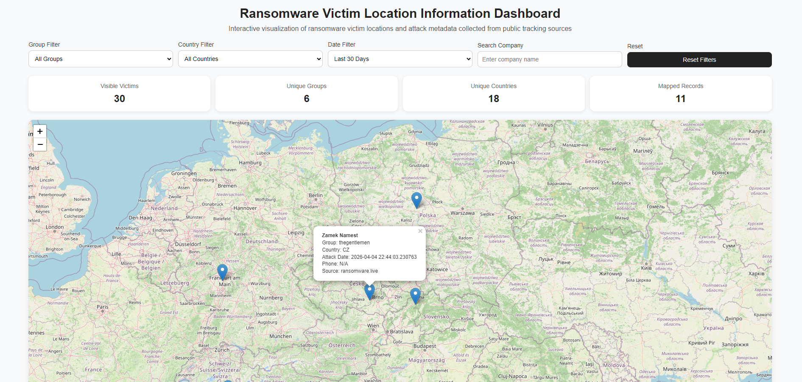
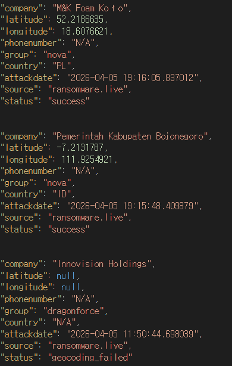

# Ransomware Victim Location Information Dashboard

본 프로젝트는 랜섬웨어 피해 기업 데이터를 수집하고, 이를 지도 기반으로 시각화하여 보안 분석 및 인사이트 도출을 지원하는 웹 대시보드입니다.

공개 랜섬웨어 트래킹 데이터를 기반으로 피해 기업의 위치, 공격 그룹, 국가, 시기 등의 정보를 통합적으로 분석할 수 있도록 설계되었습니다.

---

## Overview

랜섬웨어 피해 정보는 다크웹 및 다양한 소스에 분산되어 있어 전체 흐름을 파악하기 어렵습니다.  
본 프로젝트는 이러한 문제를 해결하기 위해 피해 데이터를 수집하고 지도 기반으로 직관적인 분석 환경을 제공합니다.

---

## Features

### 1. Map Visualization
- 피해 기업 위치를 지도 위에 마커로 표시
- 클러스터링을 통해 밀집 지역 시각화
- 지역별 피해 분포 파악 가능

### 2. Dynamic Filtering
다양한 조건 기반 데이터 탐색:
- Ransomware Group
- Country
- Date
- Company Search

필터 조합을 통해 공격 패턴 분석 가능

### 3. Dashboard Metrics
상단 통계 정보 제공:
- Visible Victims
- Unique Groups
- Unique Countries
- Mapped Records

### 4. Data Processing
- 외부 API 기반 데이터 수집
- 실패 시 fallback 데이터 사용
- Geocoding 기반 위치 매핑
- 좌표 변환 자동 처리

### 5. Search Function
- 기업명 기반 검색 기능 제공
- 특정 피해 기업 빠른 조회 가능

### 6. Reset System
- 필터 초기화 기능 제공
- 빠른 상태 복구 가능

---

## System Architecture

Data Source → Data Processing → Geocoding → Visualization Dashboard

---

## Tech Stack

Backend:
- Python
- Requests

Frontend:
- HTML / CSS / JavaScript
- Leaflet.js

---

## Project Structure
myproject/
├── myapp/
│ └── company.py
├── static/
├── templates/
├── images/
├── README.md
└── requirements.txt

---

## Installation

1. Clone repository
git clone https://github.com/your-username/ransomware-victim-map.git

cd ransomware-victim-map

2. Create virtual environment

Windows: python -m venv venv
venv\Scripts\activate

3. Install dependencies
pip install -r requirements.txt

---

## Run
python myapp/company.py

Access:http://127.0.0.1:8000

---

## Screenshots

### Dashboard

### Data Example

---

## Limitations

- API 응답 지연 또는 타임아웃 발생 가능
- Geocoding 기반 위치 정확도 한계 존재
- 데이터 완전성 보장 어려움

---

## Future Work

- 실시간 데이터 스트리밍
- MITRE ATT&CK 매핑
- 자동 분석 리포트 생성
- 알림 시스템 구축

---

## Conclusion

본 프로젝트는 분산된 랜섬웨어 피해 데이터를 통합하고 시각화하여  
보안 분석가가 빠르게 위협 상황을 파악할 수 있도록 돕는 것을 목표로 합니다.